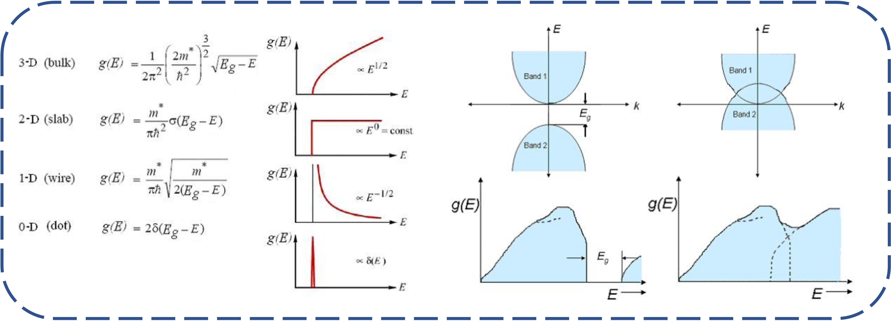

## What is density of state (DOS)

**One sentence defination**: The density of state (DOS) is the number of different states at a particular energy level that electrons are allowed to occupied(the number of electron states per unit volume per unit energy). **Application**: paramagnetic susceptibility, tranport phenomena of solids depend on this function, and determining the spacing between energy bands in semi-conductors.

### Denisty of state for wave

### Density of Electrons

# Procedure of running DOS calculation on VASP

### References

[1]Density of States. (2021, September 8). https://eng.libretexts.org/@go/page/312 
