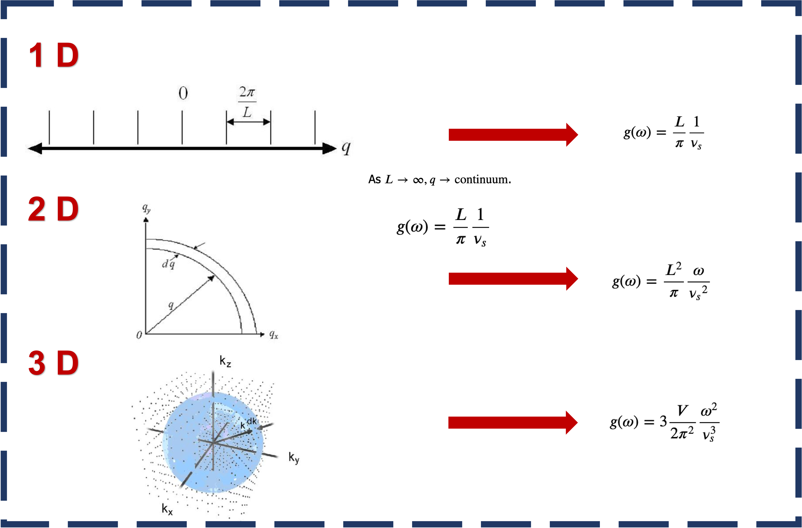

## What is density of state (DOS)

**One sentence defination**: The density of state (DOS) is the number of different states at a particular energy level that electrons are allowed to occupied(the number of electron states per unit volume per unit energy). **Application**: paramagnetic susceptibility, tranport phenomena of solids depend on this function, and determining the spacing between energy bands in semi-conductors.

### Denisty of state for wave


Markdown is a lightweight and easy-to-use syntax for styling your writing. It includes conventions for

```markdown
Syntax highlighted code block

# Header 1
## Header 2
### Header 3

- Bulleted
- List

1. Numbered
2. List

**Bold** and _Italic_ and `Code` text

[Link](url) and 
```

For more details see [Basic writing and formatting syntax](https://docs.github.com/en/github/writing-on-github/getting-started-with-writing-and-formatting-on-github/basic-writing-and-formatting-syntax).

### Interface between DOS and VASO
##Proce


### References

[1]Density of States. (2021, September 8). https://eng.libretexts.org/@go/page/312 
